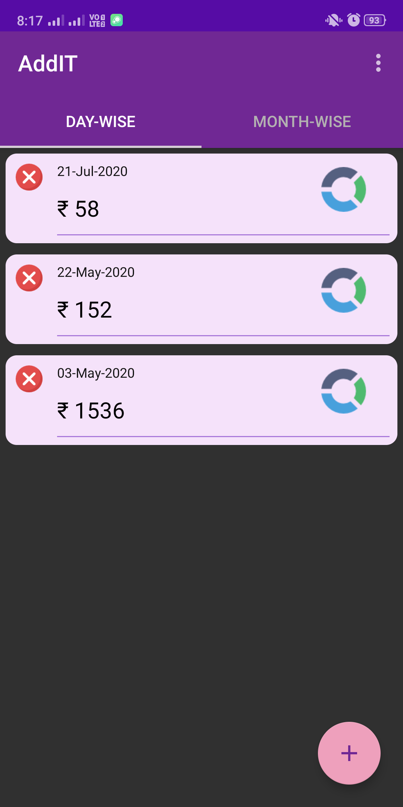
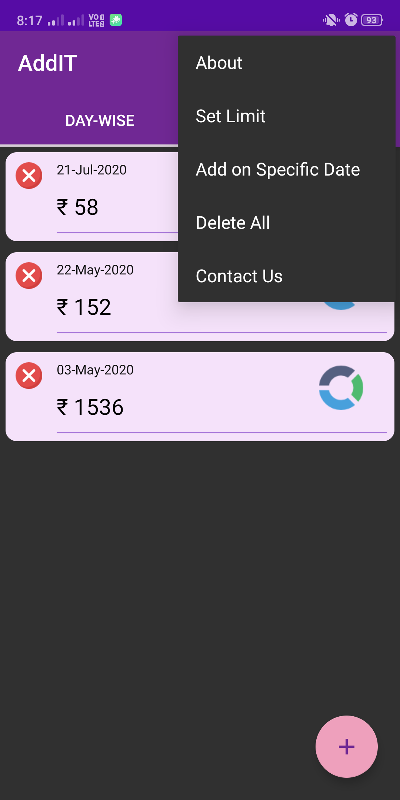
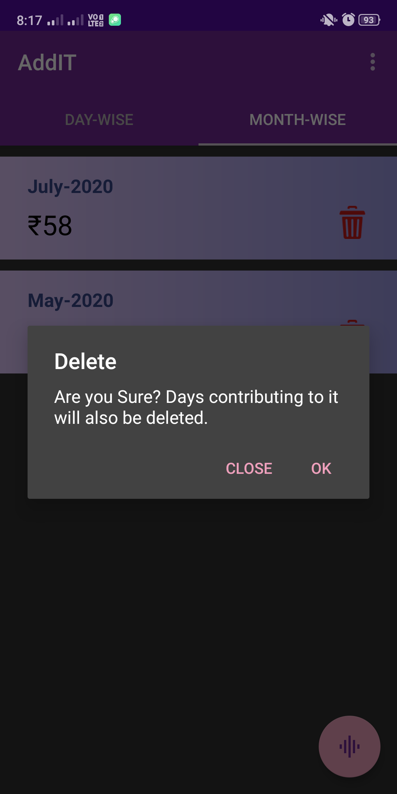
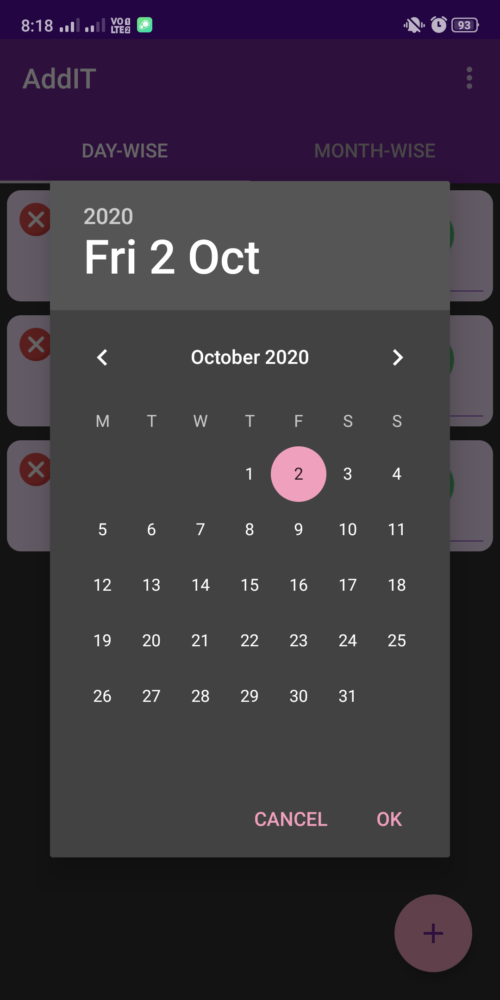
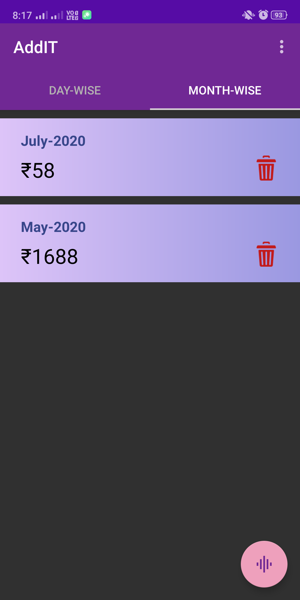
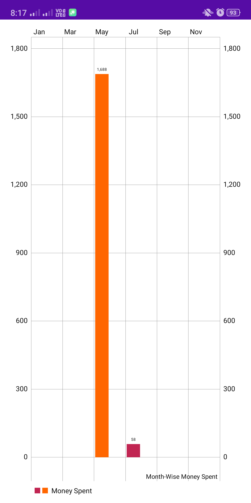
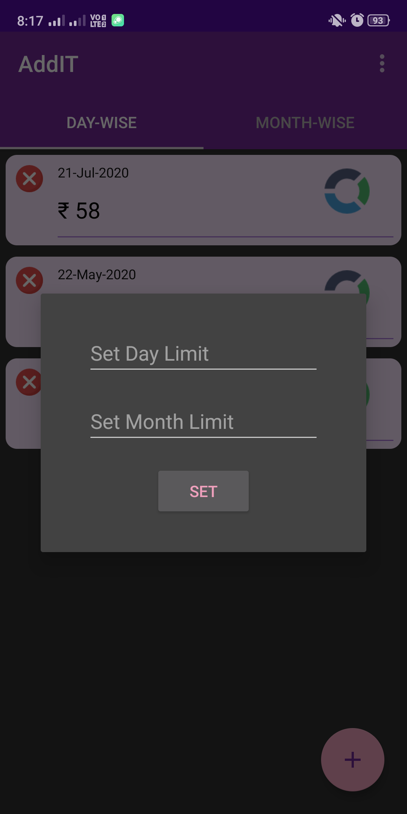
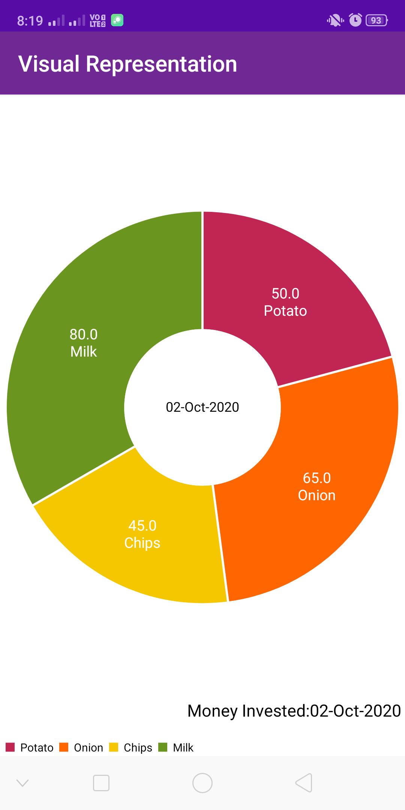

# AddIT
Who doesn't want to keep a track of much money they spend on each day but because of lack of proper resources we cannot record everything as we spend it and this results in incomplete and unreliable report. This app makes this task much easier for you as you just have to add the amount being spent on the go and it automatically combines it for a single day and also keeps track of a month-wise record. So that you can be your own accountant at just a tap of a button.

                                            

                                              
